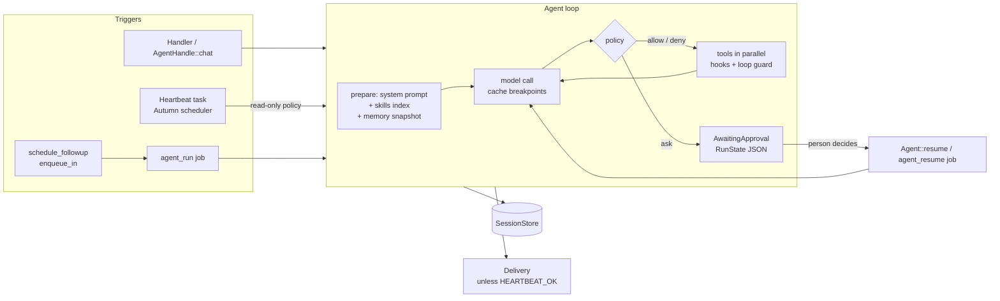

# ADR 0001 — Always-on harness primitives

- Status: accepted
- Date: 2026-10-07
- Context: [research notes](../research/always-on-agents.md)

## Context

Version 0.1 ran one prompt to one answer. Always-on agents (Muse, Dots,
Hermes, OpenClaw) wake up without a person, remember across runs, and must
not act on the world unattended without permission. Autumn 0.8 already gives
us scheduled tasks with fleet coordination, delayed and tracked jobs, and
typed app state. The crate must stay a library: no gateways, no VMs, no
product UI.

## Decision

Add small, composable primitives. Every one of them is a trait with an
in-memory default, so apps plug in their database without forks.

1. **The loop owns pauses, not errors.** A policy that wants a person returns
   `AgentOutcome::AwaitingApproval { state }`. `RunState` is plain serde data,
   so the app stores it anywhere and resumes later, in a handler or in the
   `agent_resume` job. Budget, deadline, and loop stops are outcomes too.
   `AgentOutcome` and `BudgetKind` become `#[non_exhaustive]`.
2. **Tools declare their effect.** `ToolEffect` orders the impact
   (`ReadOnly < Internal < Write < External`). Policies gate on it, and
   unattended runs default to read-only plus internal.
3. **Memory is a frozen snapshot.** The loop renders the memory blocks into
   the system prompt once per run. The `memory` tool writes through at once,
   but the prompt prefix stays stable, so the prompt cache keeps hitting.
4. **Heartbeats use Autumn's scheduler.** The plugin builds a `TaskInfo` by
   hand (fleet-coordinated by default), so one tick runs once across
   replicas. `HEARTBEAT_OK` keeps quiet ticks out of the delivery channel. A
   precheck skips the model call.
5. **Follow-ups use Autumn's delayed jobs** (`enqueue_in`). A chain cap stops
   an agent from waking itself forever.
6. **Delivery is a trait.** The crate never speaks Slack or SMTP.
7. **The run id is fixed at enqueue time.** Retried jobs keep it, so tools
   can build idempotency keys from `ToolContext`.

## Consequences

- **Breaking changes (0.1 → 0.2):**
  - `Tool::execute` takes a `&ToolContext`.
  - `AgentOutcome` and `BudgetKind` are `#[non_exhaustive]`.
  - `TokenUsage` gains the cache fields.
  - `ChatRequest` users are unaffected.
  - `AgentRunArgs` is `#[non_exhaustive]` and builds with `AgentRunArgs::new`.
  - The `autumn-web` requirement is `>=0.8, <0.9`.
- **Retries still re-run the whole loop.** Durable step checkpoints are
  deferred. The fixed run id and `ToolContext` let tools deduplicate in the
  meantime.
- **The in-memory stores lose data on restart.** Production apps must supply
  database-backed `SessionStore` and `MemoryStore` implementations.
- **Heartbeat sessions grow.** Pair a heartbeat session with `Compaction`.
